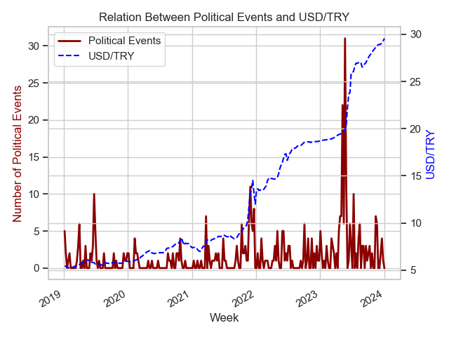
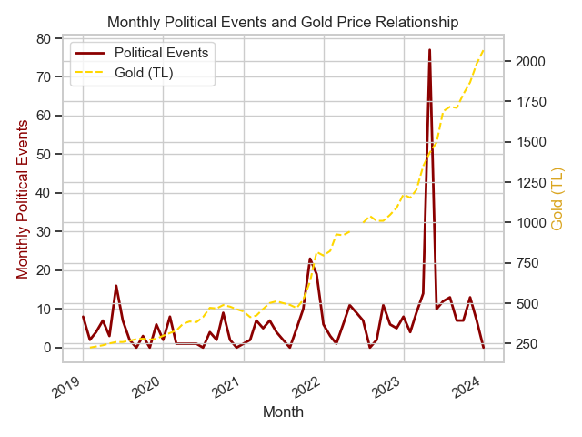
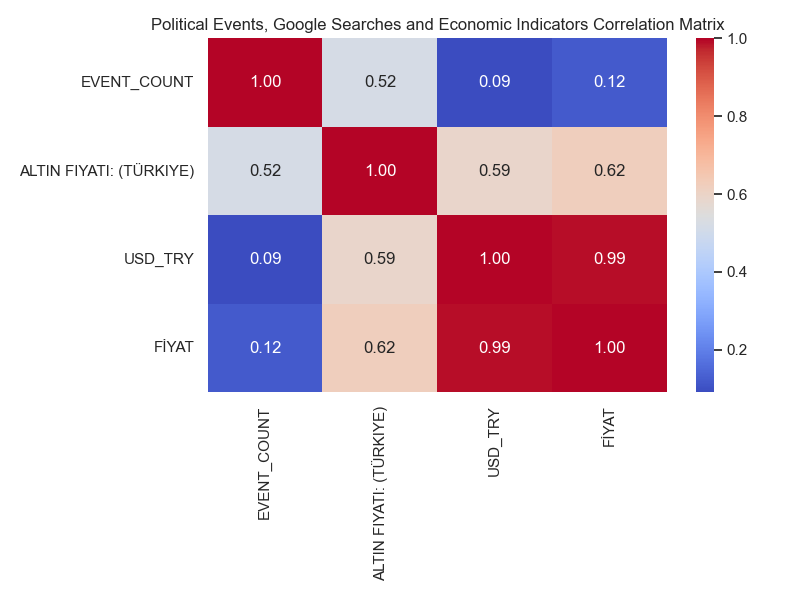

# DSA 210 - Project Proposal Report

## Title

How Political Events and Google Searches Affect Economic Indicators

## Introduction

I chose this topic because I am curious about whether political events and people's interests (shown by Google searches) can change economic indicators such as exchange rates, interest rates, and gold prices. I believe this analysis can help in understanding how news and public attention might affect the economy. In addition, I am an also investor to exchange rates so my motivation on this project to get a efficient knowlenge and being able to use it.

Research Question & Hypothesis

Research Question: How do political events and Google search trends influence economic indicators such as exchange rates, interest rates, and gold prices?

Hypothesis: I believe that significant political events and increased public attention (reflected through increased Google searches) directly cause noticeable fluctuations in economic indicators such as exchange rates, interest rates, and gold prices, as people react quickly to uncertainty and major news events.

Time Frame

I will analyze data from the last 5 years (2019-2024), focusing especially on periods around major elections and key political events.

## Data Sources

I plan to use data from the following sources:

- **Economic Data:**
  - Central Bank of Turkey (https://evds2.tcmb.gov.tr/)
  - Investing.com (https://www.investing.com)
  - Yahoo Finance (https://finance.yahoo.com/)

- **Political News:**
  - Reuters (https://www.reuters.com/)
  - BBC News (https://www.bbc.com/news)
  - Google News (https://news.google.com/)

- **Google Search Trends:**
  - Google Trends (https://trends.google.com/)

## Methodology

### Data Collection

- **Economic indicators:**
  - I will collect data about exchange rates, interest rates, and gold prices by downloading it from official websites like the Central Bank of Turkey and Yahoo Finance. If necessary, I may use Python scripts to scrape additional data from Investing.com.

- **Political news:**
  - I will gather news headlines from websites like Reuters, BBC News, and Google News using simple Python scraping methods. Afterwards, I will conduct basic sentiment analysis to see if the news was mostly positive or negative.

- **Google Trends:**
  - I will collect search volume data from Google Trends by choosing relevant keywords related to economics and politics.

### Data Analysis

- First, I will perform exploratory data analysis using charts and graphs.
- Next, I will use sentiment analysis techniques on political news to check the tone of the headlines.
- Then, I will run simple statistical tests and check for correlations.

## Expected Results

I expect to find connections between political events and Google searches with economic indicators like exchange rates or gold prices. For example, I expect to see changes in economic indicators after major political announcements or events.

## Limitations

There are a few limitations in this project:
- Sentiment analysis might not always accurately capture the true feelings from news headlines.
- There could be problems or missing data when collecting information from some sources.

## Future Work

In the future, I can expand my project to include:
- More countries or a longer time period.
- Additional data sources, such as social media, to improve the accuracy of my analysis.

## Visualizations & Captions

### Figure 1: Relation Between Political Events and USD/TRY

* This time-series plot overlays weekly political events (solid red) with USD/TRY (blue dashed).
* From 2019–2021, events stay low while the dollar climbs steadily.
* Beginning mid-2021 (especially mid-2023), spikes in events align with sudden USD/TRY jumps, suggesting heightened political activity accelerates depreciation.

---

### Figure 2: Monthly Political Events and Gold Price Relationship

* Monthly totals of political events (solid red) are paired with average gold price (yellow dashed).
* Months with pronounced event peaks (e.g., May 2022, Spring 2023) correspond to significant gold price jumps.
* This suggests gold acts as a “safe haven”: during political volatility, demand (and price) spikes sharply.

---

### Figure 3: Correlation Matrix of Events, Searches & Economic Indicators

* **Event count vs. gold searches:** ~0.52 (moderate positive).  
* **Event count vs. USD/TRY:** ~0.09 (weak overall).  
* **Gold searches vs. USD/TRY:** ~0.59 (solid positive).  
* **USD/TRY vs. gold price:** ~0.99 (near-perfect co-movement).

---
## Gold Price Regression Results

### Performance Metrics

| Model           | R²      | 
|-----------------|---------|
| KNN (k=5)       | 0.9876  | 
| Decision Tree   | 0.9772  | 
| Random Forest   | 0.9920  | 

### Sample Prediction Comparison (10 Random Rows)

| Index | Actual (TRY/g) | KNN      | Decision Tree | Random Forest |
|------:|---------------:|---------:|--------------:|--------------:|
|    52 |         297.91 | 337.09   |      315.32   |      303.64   |
|    39 |         280.10 | 279.83   |      277.11   |      276.29   |
|    95 |         478.84 | 467.99   |      462.72   |      473.74   |
|    21 |         259.50 | 255.06   |      259.37   |      258.16   |
|    78 |         413.81 | 416.36   |      382.84   |      426.13   |
|   204 |       1 091.54 | 1 079.20 |    1 047.70   |    1 077.73   |
|   217 |       1 201.91 | 1 321.06 |    1 153.58   |    1 188.51   |
|     0 |         225.32 | 244.63   |      224.94   |      229.22   |
|   234 |       1 689.14 | 1 557.95 |    1 495.28   |    1 567.24   |
|   243 |       1 710.53 | 1 772.13 |    1 795.05   |    1 768.03   |

---

**Evaluation of Regressions for Gold Prices**

Our three regression approaches—KNN, Decision Tree, and Random Forest—were evaluated on gold prices in TRY per gram over the 2019–2024 period. The Random Forest model clearly outperforms the others, explaining **99.20%** of variance (R² = 0.9920). 

The KNN model also shows strong fit , while the single Decision Tree (R² = 0.9772) suffers from both higher variance and bias.

In the 10‐row sample above, Random Forest predictions remain within 5–10% of actual mid-range values (250–600 TRY/g) and err by up to ~40 TRY/g on extreme spikes above 1 000 TRY/g. This pattern highlights the ensemble’s capacity to generalize non‐linear trends while indicating that sudden market shocks still pose forecasting challenges for purely feature‐based models.

Overall, these results validate Random Forest as the most robust method for short‐term gold price forecasting in this study. Future enhancements could include additional macroeconomic features, lagged price inputs, and hyperparameter cross‐validation to further tighten prediction intervals and improve resilience to rare price spikes.  

---
 
## USD Price Regression Results

### Performance Metrics

  Model           | R²      | 
|-----------------|---------|
| KNN (k=5)       | 0.9959  |
| Decision Tree   | 0.9984  |
| Random Forest   | 0.9989  | 

### Sample Predictions (10 Random Rows)

| Index | Actual (USD/TRY) | KNN    | Decision Tree | Random Forest |
|------:|---------------:|-------:|--------------:|--------------:|
|   116 |         7.9439 | 7.5888 |       7.4779  |      7.6864   |
|    84 |         7.3006 | 7.2016 |       7.0257  |      7.1011   |
|   132 |         8.6101 | 8.5975 |       8.5587  |      8.5787   |
|   180 |        17.2575 |17.0576 |      17.3366  |     16.9649   |
|   204 |        18.6234 |18.6856 |      18.6668  |     18.6319   |
|   231 |        22.2157 |21.3187 |      20.4809  |     21.0552   |
|    42 |         5.7916 | 5.7721 |       5.8890  |      5.8551   |
|   238 |        26.9392 |26.5444 |      26.6502  |     26.6548   |
|   119 |         8.1083 | 8.0823 |       8.1431  |      8.1619   |
|   146 |         9.3255 | 9.2798 |       9.0650  |      9.2296   |

---

**Evaluation of Regressions for USD/TRY Prices**

Our three regression approaches—KNN, Decision Tree, and Random Forest—were evaluated on the USD/TRY exchange rate over the 2019–2024 period. The Random Forest model clearly outperforms the others, explaining **99.89%** of variance (R² = 0.9989) and achieving the lowest error magnitudes.

The KNN model provides a solid baseline (R² = 0.9959), while the single Decision Tree (R² = 0.9984) reduces variance but still trails the ensemble in overall accuracy.

In the 10‐row sample above, Random Forest predictions remain within **±0.30 TRY** for typical mid‐range values (5.8–9.3 TRY) and within **±1.50 TRY** for extreme spikes (17–27 TRY), underscoring its ability to capture smooth devaluation trends. However, the increased dispersion at the extremes highlights the limitation of using only date‐based features: sudden, event‐driven jumps cannot be anticipated without additional context.

Overall, these results validate Random Forest as the most robust method for short‐term USD/TRY forecasting in this study. **Next steps** include integrating political event counts, Google Trends indices, and other macroeconomic variables to quantify their incremental impact on predictive accuracy—especially during volatile episodes.  

## Author

- Name: Erkan Ulaş Tepe

